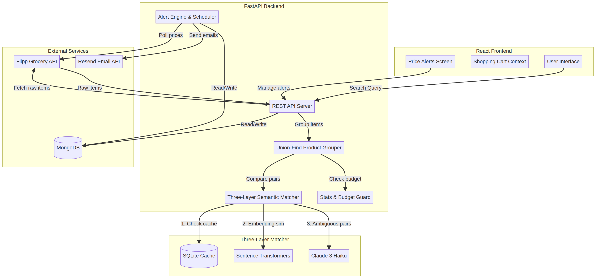

# flyrr 🛒

A comprehensive Canadian grocery price comparison platform built with React, FastAPI, MongoDB, and Claude 3. Flyrr helps users combat food inflation by searching across multiple retailers, semantically matching identical products, comparing cart totals, and tracking price drops.



## Features

* **Semantic Cross-Store Matching**: Uses a three-layer pipeline (Sentence Transformers + Claude 3 Haiku + SQLite Cache) to automatically group identical products sold under different names across different stores.
* **Smart Shopping Cart**: Build a cart from grouped products, and Flyrr will calculate the cheapest single store to buy your entire list, plus the theoretical maximum savings if you split your trip.
* **Price Drop Alerts**: Set target prices for specific items. A background APScheduler task polls prices daily and emails you (via Resend) when your target is hit.
* **Cost Guards & Analytics**: Built-in budget limits (`MAX_CLAUDE_CALLS_PER_REQUEST`) prevent LLM runaway costs. View runtime stats at `/api/stats`.
* **Evaluation Harness**: Includes an evaluation script (`eval_matcher.py`) to measure the accuracy, precision, and latency of the semantic matching pipeline against a labelled dataset.

## Architecture

The system is split into two main components:

1. **Frontend (`/web`)**: A Vite + React + TypeScript single-page application. Uses React Context for state management and React Router for navigation.
2. **Backend (`/backend`)**: A FastAPI Python application.
   * `server.py`: REST API endpoints and core application setup.
   * `semantic_matcher.py`: The three-layer LangChain pipeline for product matching.
   * `product_grouper.py`: Union-find algorithm to group items across $N$ stores in $O(N^2)$ comparisons, guarded by a Claude API budget.
   * `alerts.py` & `scheduler.py`: Background price polling and email notifications.
   * `eval_matcher.py`: Evaluation harness for the semantic matcher.

## Getting Started

### Prerequisites

* Node.js 18+
* Python 3.10+
* MongoDB instance (local or Atlas)
* Anthropic API Key (for Claude 3)
* Resend API Key (for email alerts)

### Backend Setup

1. Navigate to the backend directory:
   ```bash
   cd backend
   ```
2. Install dependencies:
   ```bash
   pip install -r requirements.txt
   ```
3. Create a `.env` file based on the provided `.env.example`:
   ```env
   MONGO_URL=mongodb://localhost:27017
   DB_NAME=flyrr
   ANTHROPIC_API_KEY=your_anthropic_key
   RESEND_API_KEY=your_resend_key
   MAX_CLAUDE_CALLS_PER_REQUEST=5
   ```
4. Run the server:
   ```bash
   uvicorn server:app --reload --port 8000
   ```

### Frontend Setup

1. Navigate to the web directory:
   ```bash
   cd web
   ```
2. Install dependencies:
   ```bash
   npm install
   ```
3. Create a `.env` file:
   ```env
   VITE_API_URL=http://localhost:8000/api
   ```
4. Start the development server:
   ```bash
   npm run dev
   ```

## Evaluation Harness

To evaluate the semantic matcher against the built-in labelled dataset:

```bash
cd backend
python eval_matcher.py --verbose
```

To run against a custom CSV:

```bash
python eval_matcher.py --csv path/to/pairs.csv --output results.json
```

## License

MIT License
